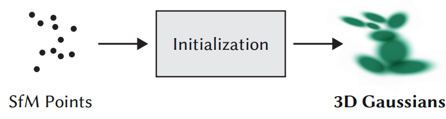
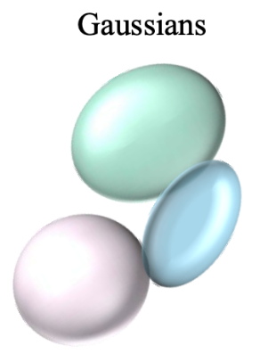
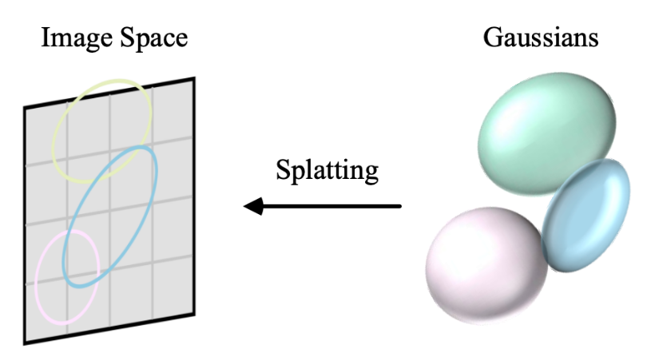
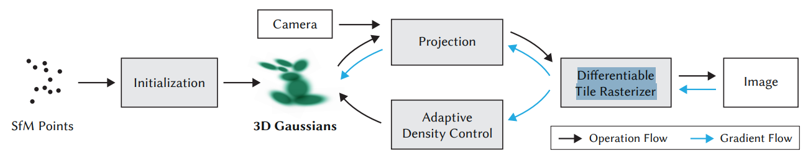
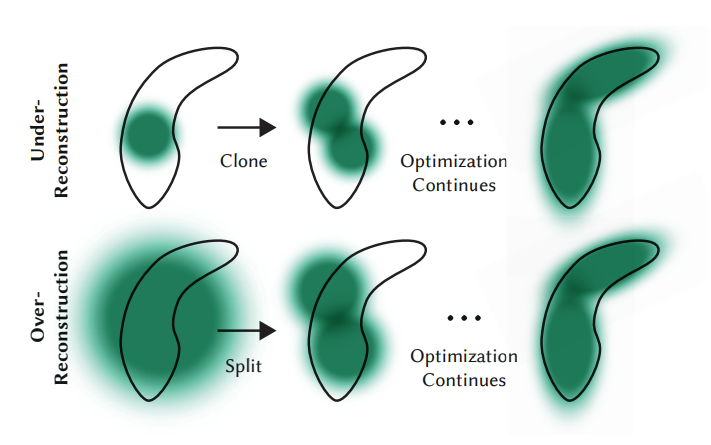
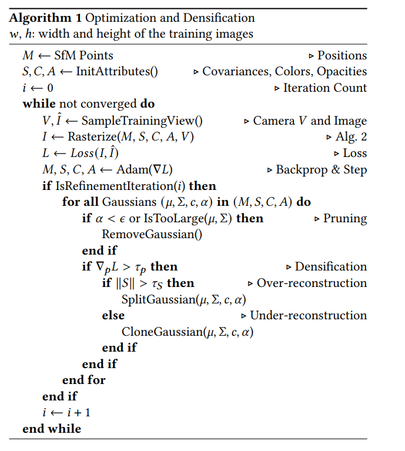

# Gaussian Splatting: Learning Notes and Annotated Code

This folder contains my learning notes for **3D Gaussian Splatting (GS)**—a recent SOTA method for real-time neural scene rendering.

## 1. SfM Points Initialization

- Gaussian Splatting starts with a sparse set of **Structure-from-Motion (SfM) points**—3D points reconstructed from multi-view images.
- These points provide the initial locations for placing 3D Gaussians in the scene.


<div align="center">
  
  <p><em>SfM Points and Initialization</em></p>
</div>


---

## 2. What is a 3D Gaussian? How Can it Represent a Sphere in Space?

- A **3D Gaussian** is parameterized by:
  - Center position: \(\mu = (x, y, z)\)
  - Covariance matrix: \(\Sigma\) (controls the orientation and shape, e.g., sphere, ellipsoid)
  - Color: \(c = (R, G, B)\)
  - Opacity: \(\alpha\)
- With a diagonal or isotropic covariance, the Gaussian represents a **sphere**; with a full covariance, it can stretch into an **ellipsoid**.


<div align="center">
  
  <p><em>3D Gaussians</em></p>
</div>

---

## 3. From Gaussians to Image: How Does the Projection Work? (3D→2D)

- Each 3D Gaussian is **projected** onto the image plane using the camera pose.
- The 3D covariance \(\Sigma\) is transformed (by perspective projection) into a 2D ellipse, determining how the Gaussian "splat" covers pixels in image space.

<div align="center">
  
  <p><em>Projection and Splatting</em></p>
</div>

- **Splatting:** All Gaussians are rendered onto the image grid, overlapping as needed, to form the final image.

---

## 4. What is a Differentiable Tile Rasterizer?

- The **Differentiable Tile Rasterizer** is a fast, GPU-friendly way to render thousands of overlapping 2D ellipses (from projected Gaussians) onto an image.
- It supports **gradient backpropagation** so that the position, shape, color, and opacity of each Gaussian can be optimized during training.


<div align="center">
  
  <p><em>GS Pipeline Overview</em></p>
</div>

---

## 5. Loss Computation and Backpropagation

- The rendered image is compared to the ground-truth photo using a loss function (usually MSE).
- Gradients of the loss are **backpropagated** through the rasterizer to update all Gaussian attributes (position, color, covariance, opacity).
- Training involves alternating rasterization, loss computation, and parameter updates.

---

## 6. Adaptive Density Control

- The algorithm adaptively **adds**, **removes**, **splits**, or **merges** Gaussians based on their contribution to the image and the density of coverage:
    - **Pruning:** Remove weak or redundant Gaussians.
    - **Densification:** Split strong Gaussians to improve detail (over-reconstruction) or clone for under-reconstruction.

<div align="center">
  
  <p><em>Under- and Over-Reconstruction</em></p>
</div>

- This leads to a compact, high-fidelity scene representation.


<div align="center">
  
  <p><em>Optimization & Densification Algorithm</em></p>
</div>

---

## Algorithm Summary

```text
1. Initialize 3D Gaussians from SfM points.
2. Project all Gaussians onto the image plane (per camera view).
3. Rasterize with a differentiable tile rasterizer.
4. Compute image loss and backpropagate to update all Gaussian attributes.
5. Adaptively refine: prune, split, or clone Gaussians.
6. Repeat until convergence.
```
---

## References

- [3D Gaussian Splatting for Real-Time Radiance Field Rendering (SIGGRAPH 2023)](https://repo-sam.inria.fr/fungraph/3d-gaussian-splatting/)
- [Official GS Codebase](https://github.com/graphdeco-inria/gaussian-splatting)

---

## Next steps

- Test GS on different datasets and compare speed/quality to NeRF

---
