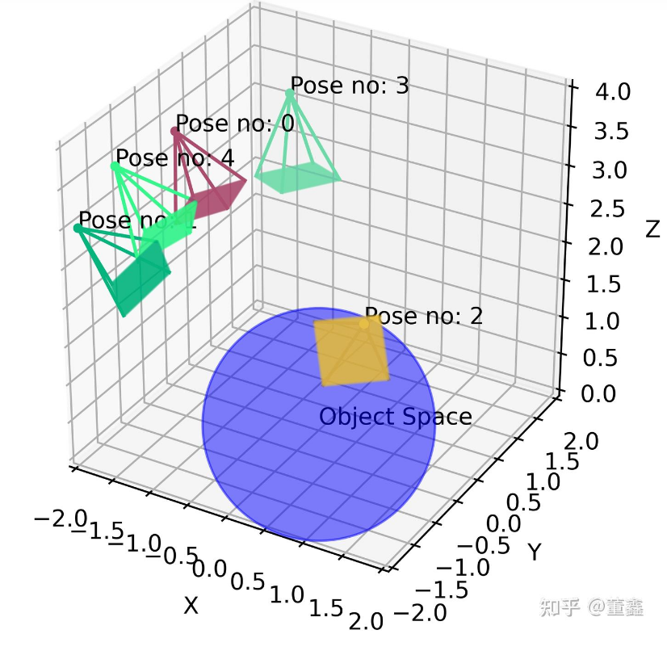
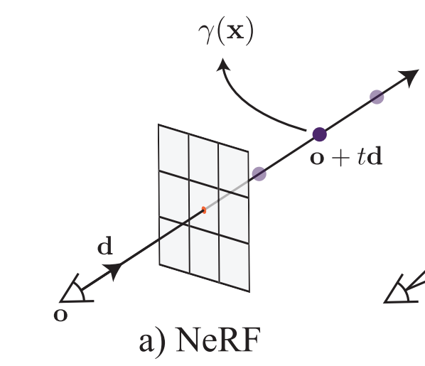
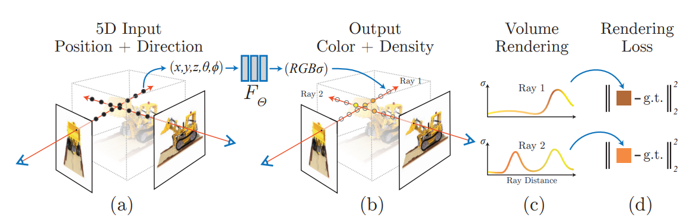

# NeRF from Nothing

This notebook documents my self-learning and full pipeline implementation of **Neural Radiance Fields (NeRF)**.  
I focus on the essential concepts, code, and math, aiming for a practical and theoretical understanding.

## Overview

NeRF is a groundbreaking method for synthesizing novel views of complex scenes from images with known poses.  
Given several photos and camera poses, NeRF optimizes a neural network to represent a 3D scene as a continuous function, enabling photorealistic view synthesis from arbitrary viewpoints.

---

## 1. Images and Camera Poses as Input

- NeRF starts with a set of images and corresponding camera poses.
- Poses are either precomputed or estimated (e.g., with COLMAP).
- Typical workflows use Google Colab for reproducibility and GPU support.

  
  
<em>Camera Poses Example</em>

---

## 2. Ray Sampling and 3D Query Points

- For every input pixel, we know its camera and direction (pose).
- We cast a ray from each camera through every pixel, computing 3D sample points along each ray:
  - Each sample is represented as `(x, y, z, θ, φ)` (position and viewing direction).

  
  
<em>Ray Sampling Principle</em>

---

## 3. Random Initialization of Network (RGB, Sigma)

- Each 3D point is fed into a neural network with randomly initialized weights.
- The network outputs:
  - **Color** (`RGB`) at that position/view
  - **Density** (`σ`, or sigma): measures how much the point occludes light along the ray

---

## 4. Volume Rendering

- NeRF uses volume rendering to synthesize the color seen along each camera ray.
- For each ray:
  - Integrate the colors and densities of all points sampled along the ray
  - Compute the final pixel color as a weighted sum (accounting for occlusion/opacity)

 <!-- main pipeline diagram -->
- For a detailed explanation, see my [Notion notes on Volume Rendering](https://www.notion.so/NeRF-f5434b7515754a1c99d24eeb2d17144d).

---

## 5. Loss Calculation and Backpropagation

- The synthesized pixel color is compared to the true pixel color in the input image.
- The mean squared error (MSE) loss is computed over all rays and pixels.
- The network is optimized (via backpropagation) to minimize this loss, updating `RGB` and `sigma` predictions to better match ground-truth images.

---

## 6. Positional Encoding

- NeRF uses high-frequency positional encoding to improve the network's ability to represent fine details.
- 3D coordinates and view directions are mapped into higher-dimensional space using sine/cosine functions, similar to transformers.

---

## 7. Hierarchical Volume Sampling

- NeRF employs a two-stage sampling process:
  1. **Coarse Network**: Uniformly samples points along rays for a rough estimate.
  2. **Fine Network**: Resamples points based on the coarse results, focusing on areas of high density (details/edges).
- This increases efficiency and rendering quality.

---

## 8. Model Structure

- NeRF’s network is a fully connected (MLP) model.
- Takes in positional encodings and outputs `(R, G, B, σ)` for each 3D point and view.
- Training requires many iterations and high memory, but results in a compact and expressive scene representation.

---

## References

- [NeRF: Representing Scenes as Neural Radiance Fields for View Synthesis](https://arxiv.org/abs/2003.08934)
- [My Notion Notes on Volume Rendering](https://www.notion.so/NeRF-f5434b7515754a1c99d24eeb2d17144d)

---

## Next Steps

- Test with larger datasets and real-world scenes.
- Explore NeRF extensions (Mip-NeRF, Instant-NGP, etc).

---

*All diagrams and code are part of my independent study and practical implementation of NeRF.*
